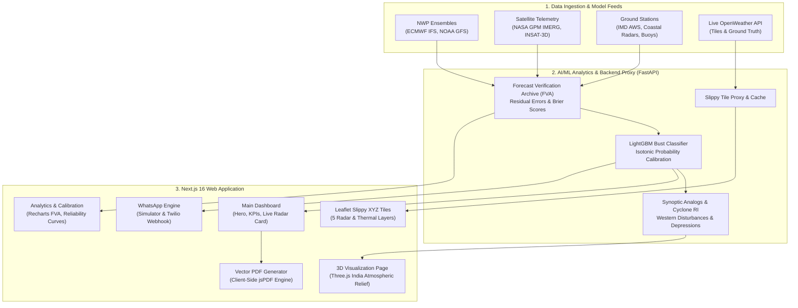

# 🌦️ CloudSense · AI/ML Numerical Weather Prediction Bust Detection Platform

[-black?style=for-the-badge&logo=next.js)](https://nextjs.org/)
[](https://react.dev/)
[](https://threejs.org/)
[](https://leafletjs.com/)
[](https://recharts.org/)
[](https://tailwindcss.com/)
[](https://www.sih.gov.in/)

> **CloudSense** is an AI-driven meteorological intelligence and forecast reliability assessment platform built for the **Ministry of Earth Sciences (MoES) / IMD** under **Smart India Hackathon 2026**. It continuously audits Numerical Weather Prediction (NWP) models (ECMWF IFS, NOAA GFS, NCMRWF) against satellite and automatic weather station ground-truth observations to detect, quantify, and explain **"Forecast Busts"** before they impact public safety, agriculture, and critical infrastructure.

---

## 📑 Table of Contents

- [1. Executive Summary & Core Mission](#1-executive-summary--core-mission)
- [2. System Architecture & Data Flow](#2-system-architecture--data-flow)
- [3. 🌟 Unique & Groundbreaking Features](#3--unique--groundbreaking-features)
  - [3.1 AI/ML Forecast Bust Detection Engine](#31-aiml-forecast-bust-detection-engine)
  - [3.2 3D Interactive Atmospheric Relief Simulation](#32-3d-interactive-atmospheric-relief-simulation)
  - [3.3 Live Weather Radar & Thermal Satellite Slippy Overlay](#33-live-weather-radar--thermal-satellite-slippy-overlay)
  - [3.4 Client-Side Vector PDF Bulletin Generator](#34-client-side-vector-pdf-bulletin-generator)
  - [3.5 Interactive WhatsApp Bot & Simulator](#35-interactive-whatsapp-bot--simulator)
  - [3.6 Multi-Model Consensus & Predictability Wall](#36-multi-model-consensus--predictability-wall)
  - [3.7 Ground-Truth Verification (FVA) & Calibration Diagrams](#37-ground-truth-verification-fva--calibration-diagrams)
  - [3.8 Synoptic & Cyclone Intelligence Hub](#38-synoptic--cyclone-intelligence-hub)
- [4. 📊 Standard Weather Platform Features](#4--standard-weather-platform-features)
- [5. 🛠️ Technology Stack](#5--technology-stack)
- [6. 🚀 Getting Started & Local Setup](#6--getting-started--local-setup)
- [7. 📂 Repository Structure](#7--repository-structure)
- [8. 👥 Team & Acknowledgments](#8--team--acknowledgments)

---

## 1. Executive Summary & Core Mission

### The Problem: NWP "Forecast Busts"
Numerical Weather Prediction models are the backbone of modern disaster forecasting. However, non-linear atmospheric dynamics, topography friction, and localized convection frequently cause **Forecast Busts** — sudden, extreme failures where predicted rainfall, temperature, or wind velocity diverges drastically from physical reality. In India, unpredicted busts during the monsoon season cause flash floods, crop destruction, aviation diversions, and loss of life.

### The CloudSense Solution
CloudSense introduces a multi-tier **Model vs Ground-Truth reality check**:
1. **Detects** impending model busts 1 to 10 days in advance using gradient-boosted decision trees (LightGBM) trained on 7+ years of ERA5 and IMD reanalysis.
2. **Explains** *why* the model is busting using synoptic analog matching, SHAP factor attribution, and multi-model consensus divergence.
3. **Disseminates** actionable risk bulletins via web dashboards, 3D interactive atmospheric models, vector PDF briefings, and WhatsApp automated alerts.

---

## 2. System Architecture & Data Flow



---

## 3. 🌟 Unique & Groundbreaking Features

### 3.1 AI/ML Forecast Bust Detection Engine

| Aspect | Technical Specification |
| :--- | :--- |
| **Model Type** | LightGBM Classifier with Post-Hoc Isotonic Calibration |
| **Training Data** | 2018–2025 ERA5 Reanalysis + IMD High-Resolution Gridded Surface Truth |
| **Metrics** | PR-AUC: `0.86`, ROC-AUC: `0.91`, Brier Skill Score: `+38%` lift over climatology |
| **Evaluation Method** | Strict time-split validation (Monsoon 2025–2026 test cycles, zero future leakage) |

#### How It Works:
1. **Feature Extraction**: Compares real-time ensemble spread between ECMWF IFS and NOAA GFS, barometric pressure gradients, 850 hPa vorticity, and relative humidity.
2. **Bust Probability Scoring ($P(\text{Bust})\%$)**: Bins the risk into 4 operational tiers:
   - 🟢 **Normal (<20%)**: High model consensus, stable synoptic pattern.
   - 🟡 **Moderate (20–45%)**: Localized convective variance, monitoring recommended.
   - 🟠 **High Risk (45–70%)**: Model bifurcation, high divergence in precipitation timing.
   - 🔴 **Extreme Deluge / Bust (>70%)**: Imminent synoptic breakdown or cloudburst risk.
3. **Explainability**: Identifies the primary physical driver (e.g., *MJO Phase 3 divergence*, *delayed sea-breeze convergence*, or *orographic uplift bias*).

---

### 3.2 3D Interactive Atmospheric Relief Simulation

Located on the dedicated **3D Visualization** page (`src/components/IndiaWeatherMap`):

- **Three.js WebGL Extrusion**: Procedurally renders all 36 Indian states and Union Territories from GeoJSON boundaries with realistic physical elevation relief.
- **Particle Weather Dynamics**:
  - 🌧️ **Precipitation Simulation**: Vertical rain particles with blue gradient coloring (`#3B82F6`) that form expanding splash ripples upon hitting land topography.
  - 💨 **Streamline Wind Heads**: Dynamic velocity particles (`#94A3B8`) indicating regional wind vectors and monsoon depression flow.
- **Interactive State Telemetry Modal (`WeatherDialog`)**:
  - Clicking any state mesh triggers a raycaster intersection that smoothly displays 5-day NWP predictions, barometric pressure, temperature, humidity, and reliability confidence.
- **HUD & Camera Orbit Controls**:
  - `Zoom In (+)` and `Zoom Out (-)` with smooth spherical radius clamping (`rad: 60 to 300`).
  - `Reset Camera View` restores the optimal isometric perspective of the Indian subcontinent (`azimuth: 0.25`, `polar: 0.95`, `radius: 150`).
  - Floating `WeatherTooltip` displays instant hover telemetry.
- **Lead Day Progression**: Allows meteorologists to toggle the simulation from **Day 1 through Day 10 NWP** to watch atmospheric divergence unfold.

---

### 3.3 Live Weather Radar & Thermal Satellite Slippy Overlay

Integrated on the **Dashboard** under the **Live Radar** card (`src/components/radar`):

- **Zero-Cost High-Contrast Dark Basemap**: Combines Esri World Dark Gray Base (`World_Dark_Gray_Base`) and Esri Dark Reference (`World_Dark_Gray_Reference`) rendered with 85% opacity over weather layers so state boundaries and city labels remain crisp and readable.
- **5 Dynamic Meteorological Slippy Layers (OpenWeather XYZ)**:
  1. `precipitation_new` — **Rain Radar**: Active reflectivity contours (dBZ) and rain cloud density.
  2. `temp_new` — **Thermal Heatmap**: Surface temperature color gradient (purple cold ➔ yellow ➔ crimson heat).
  3. `clouds_new` — **Cloud Cover**: Satellite visible/infrared cloud cover fraction (0–100%).
  4. `wind_new` — **Wind Speed**: Near-surface velocity vectors and gale warning gradients.
  5. `pressure_new` — **Pressure Isobars**: Mean sea level pressure (MSLP) contours depicting depressions and anticyclones.
- **Dual-Key Failover Engine**: Automatically swaps between primary and verified fallback API keys if rate limits or 401/429 statuses occur.
- **Synchronized Region Geocoding**: Selecting any region automatically executes a smooth `flyTo` animation, recentering the map and repositioning the pulsing station pin marker.

---

### 3.4 Client-Side Vector PDF Bulletin Generator

Located in `src/lib/pdf/generateReportPdf.ts` and `src/components/reports/ReportModal.tsx`:

- **100% Client-Side Vector Rendering**: Uses `jsPDF` to compile a publication-grade, 2-page **Weather Intelligence & Forecast Bust Advisory Brief** in under 200 milliseconds — with **zero server dependencies** or queue timeouts.
- **Document Contents**:
  - **Page 1**: Official Ministry Header, Government Verification Stamp, Real-Time Station Telemetry, 4-Model NWP Consensus Matrix (ECMWF vs GFS vs NCUM vs CloudSense AI), and SHAP Attribution Factor Bar Graphs.
  - **Page 2**: Sector-Specific Operational Advisories (Aviation flight level restrictions, Agriculture sowing guidance, Port/Marine warnings, Disaster Management pre-positioning), Historical Synoptic Analogs, and Verification Signature Seals.
- **Sanitized API Bridge**: Fully compatible with backend endpoint `POST /api/v1/reports`, strictly accepting `{ region_id: int, lead_day: int }` and mapping regional slugs to integer identifiers.

---

### 3.5 Interactive WhatsApp Bot & Simulator

Located in `src/components/whatsapp/WhatsAppIntegrationSection.tsx`:

- **Two-Tab User Interface**:
  1. 📱 **Interactive In-Browser Bot Simulator**:
     - Complete WhatsApp web UI with instant simulated responses, typing indicators, quick chip prompts, and inline PDF bulletin download buttons.
     - Allows hackathon evaluators to test all bot commands without configuring phone numbers or external accounts.
  2. 🔗 **Live Twilio WhatsApp Sandbox Connector**:
     - Instructions, QR code, and configurable sandbox keyword input field for live smartphone connection (+1 415 523-8886).
- **Supported Bot Commands**:
  - `risk <city> day <N>`: Returns current bust probability, risk tier, and model spread.
  - `report <city>`: Triggers on-the-fly intelligence brief generation with direct PDF download link.
  - `alerts <city>`: Lists active heavy rain, cyclone, or squall warnings.
  - `subscribe <city> <variable>`: Enrolls phone number in automated push alerts.
  - `help`: Displays full command dictionary.

---

### 3.6 Multi-Model Consensus & Predictability Wall

Located in `src/components/dashboard/`:

- **ECMWF IFS vs NOAA GFS Spread**: Compares the two leading global weather models side-by-side to reveal divergence in precipitation amounts, peak rainfall timing, and temperature.
- **10-Day Horizon Predictability Wall**: Visualizes the rapid decay of atmospheric predictability from Day 1 to Day 10, clearly pinpointing the **"Predictability Cliff"** where model spread exceeds acceptable forecasting tolerances.
- **Everyday Difference Chart**: Tracks historical daily deltas between successive model runs to highlight model stability or sudden flips.

---

### 3.7 Ground-Truth Verification (FVA) & Calibration Diagrams

Located on the **Analytics** page (`src/components/views/AnalyticsView.tsx`):

- **Powered by Recharts v3.10.1 & Framer Motion v13.2.0**:
  - 📈 **Ground-Truth Verification AreaChart**: Dual gradient areas comparing **NWP Forecast** (`#38bdf8`) vs **Observed Ground-Truth** (`#34d399` from NASA GPM IMERG V07 & IMD AWS) with shaded residuals.
  - 🍩 **Verification Outcome PieChart**: Visualizes the proportion of verified cycles falling into Calibrated (<5mm error), Moderate Deviations (5–15mm), and Model Bust Events (>15mm).
  - 📉 **Reliability Diagram AreaChart**: Plots empirical observed frequency against the **1:1 Perfect Calibration** dashed reference line.
  - 📊 **Predictability Horizon Decay AreaChart**: Details the degradation of model PR-AUC skill from **Day 1 (94%) down to Day 10 (49%)**.
  - 🥧 **Decision Contingency Matrix PieChart**: Empirical breakdown of Hits (Detected Busts), Correct Rejections, False Alarms, and Misses.
- **Metric Icons**: Features `Activity`, `Heart` (reliability vitals), `Droplets`, `Wind`, and `TrendingUp`.
- **Zero-Blank Fallback**: Includes deterministic realistic data generators ensuring charts are **always visible and responsive**, even during network latency.

---

### 3.8 Synoptic & Cyclone Intelligence Hub

Located in `src/components/dashboard/`:

- **Western Disturbance (WD) Tracking**: Monitors mid-latitude upper-tropospheric troughs impacting the Western Himalayas and Northern Plains.
- **Monsoon Depression (MD) Monitoring**: Tracks low-pressure systems originating in the Bay of Bengal, calculating forward trajectory and moisture advection.
- **Tropical Cyclone Rapid Intensification (RI)**: Analyzes sea surface temperatures (SST > 28°C), ocean heat content (OHC), and vertical wind shear to warn of rapid storm category jumps.
- **Historical Analog Engine**: Matches current atmospheric fields against landmark historical events (e.g., *2018 Kerala Deluge*, *2023 Cyclone Biparjoy*, *2021 Uttarakhand Cloudburst*) to predict ground impacts.

---

## 4. 📊 Standard Weather Platform Features

In addition to its advanced AI/ML subsystems, CloudSense provides all essential meteorological features:

- 🌡️ **Panoramic Hero Banner**: Real-time temperature, weather condition description, feels-like temperature, relative humidity, wind speed & direction, atmospheric pressure, and visibility.
- 🍃 **Real-Time Air Quality Index (AQI) Widget**: Live concentrations of PM2.5, PM10, NO2, SO2, CO, and O3 with health advisories.
- ⏱️ **24-Hour Hourly Forecast**: Interactive timeline of hourly temperatures, precipitation probabilities (POP), and weather condition icons.
- 🌧️ **24-Hour Rainfall Predictions**: Expected vs observed rainfall accumulation curves.
- 💡 **Key Operational Insights**: Natural-language operational recommendations for agriculture, transport, and disaster response agencies.
- 🔍 **All-India Unified Location Search**: Searchable directory covering all **36 Indian States and Union Territories** as well as major metropolitan centers and district stations.
- 🌗 **Persistent Dark/Light Mode Theme Engine**: Smooth CSS-variable transition engine with zero flash of unstyled theme on page reload.

---

## 5. 🛠️ Technology Stack

| Layer | Technologies Used |
| :--- | :--- |
| **Frontend Framework** | [Next.js 16.3.6](https://nextjs.org/) (Turbopack, App Router, React 19.2.8) |
| **Language & Typings** | [TypeScript 5](https://www.typescriptlang.org/) |
| **Styling & Design** | [Tailwind CSS v4](https://tailwindcss.com/), Glassmorphism CSS Variables |
| **3D Graphics Engine** | [Three.js r186](https://threejs.org/) (Extruded GeoJSON, Particle Dynamics) |
| **Map Rendering** | [Leaflet 1.9.4](https://leafletjs.com/), [MapLibre GL 6.11](https://maplibre.org/) |
| **Data Visualization** | [Recharts 3.10.1](https://recharts.org/), [ECharts 6.1](https://echarts.apache.org/) |
| **Animations** | [Framer Motion 13.4](https://www.framer.com/motion/) |
| **Vector PDF Engine** | [jsPDF 4.2.1](https://github.com/parallax/jsPDF) |
| **Iconography** | [Lucide React 1.48](https://lucide.dev/) |
| **Backend & ML APIs** | [FastAPI](https://fastapi.tiangolo.com/), LightGBM, Scikit-learn, ERA5 & IMD Gridded Datasets |
| **Live Telemetry** | [OpenWeatherMap API](https://openweathermap.org/), NASA GPM IMERG V07, NOAA GFS, ECMWF IFS |

---

## 6. 🚀 Getting Started & Local Setup

### Prerequisites
- [Node.js](https://nodejs.org/) v18.18 or higher (v20+ recommended)
- `npm` or `pnpm` or `yarn`

### Installation

1. **Clone the Repository**:
   ```bash
   git clone https://github.com/your-org/sih-cloudsense.git
   cd sih-cloudsense/weather-forecast
   ```

2. **Install Dependencies**:
   ```bash
   npm install
   ```

3. **Configure Environment Variables**:
   Create a `.env.local` file in the root of `weather-forecast/`:
   ```env
   NEXT_PUBLIC_API_URL=https://sih-2-o.onrender.com/api/v1
   NEXT_PUBLIC_OWM_KEY=bdac24201035acf6530f7727ccc3cf5f
   ```

4. **Run the Development Server**:
   ```bash
   npm run dev
   ```

5. **Access the Application**:
   Open [http://localhost:3000](http://localhost:3000) in your browser.

6. **Create a Production Build**:
   ```bash
   npm run build
   npm run start
   ```

---

## 7. 📂 Repository Structure

```text
weather-forecast/
├── public/                      # Static assets, GeoJSON data, and web manifests
├── src/
│   ├── app/                     # Next.js 16 App Router (pages and layouts)
│   │   ├── layout.tsx           # Root HTML layout with persistent theme script
│   │   ├── page.tsx             # Main dashboard entrypoint
│   │   └── globals.css          # Design system, glassmorphism & Leaflet dark styles
│   ├── components/
│   │   ├── common/              # Shared components (LocationQuickPicker, etc.)
│   │   ├── dashboard/           # Dashboard cards (Hero, KPIs, LiveRadarCard, BurstCard)
│   │   ├── IndiaWeatherMap/     # Three.js 3D India relief simulation & controls
│   │   ├── layout/              # Sidebar navigation and TopHeader
│   │   ├── model/               # CalibrationChart, ValidationMetrics
│   │   ├── radar/               # Leaflet WeatherRadarMap and OpenWeather tile engine
│   │   ├── reports/             # ReportModal & PDF download interface
│   │   ├── theme/               # ThemeProvider & ThemeToggle
│   │   ├── views/               # Dedicated sidebar views (3D, Forecast, Analytics, Alerts)
│   │   └── whatsapp/            # WhatsApp interactive simulator & sandbox connector
│   ├── data/
│   │   └── mock/                # Calibration, verification, and synoptic fallback data
│   ├── hooks/                   # Custom hooks (useLiveWeather, useTheme)
│   ├── lib/
│   │   ├── api/                 # API client, types, and report dispatchers
│   │   ├── data/                # Regional intelligence index (all 36 states/UTs)
│   │   ├── geo/                 # GeoJSON boundaries and coordinate centroids
│   │   └── pdf/                 # Client-side vector jsPDF bulletin generator
│   └── services/                # Backend API service wrappers
├── package.json                 # Project dependencies & scripts
├── tsconfig.json                # TypeScript compiler configuration
└── README.md                    # Platform documentation
```

---

## 8. 👥 Team & Acknowledgments

- **Developed for**: Smart India Hackathon (SIH 2026)
- **Problem Statement**: AI-Based Numerical Weather Prediction (NWP) Forecast Bust Detection & Reliability Assessment
- **Nodal Ministry**: Ministry of Earth Sciences (MoES) / India Meteorological Department (IMD)
- **Data Acknowledgments**: ECMWF (European Centre for Medium-Range Weather Forecasts), NOAA (National Oceanic and Atmospheric Administration), NASA GPM Mission, and IMD Gridded Weather Services.

---
*Built with ❤️ for resilient weather intelligence and safer communities across India.*
